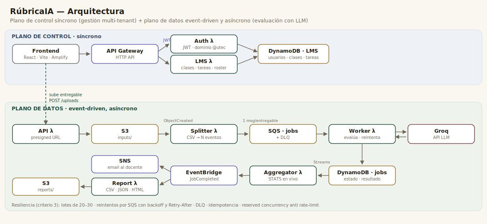

# RúbricaIA

Plataforma donde un docente crea clases y tareas con su **rúbrica**, e invita a sus
estudiantes; cada alumno sube su entregable en **PDF o Word** y un **LLM (Groq)** lo
revisa **criterio por criterio**, devolviendo cumplimiento, faltantes y sugerencias
accionables. El docente ve las entregas y estadísticas de toda la clase en vivo.

Construida para el reto de Cloud Computing: **arquitectura basada en eventos, asíncrona y
predominantemente serverless**, con procesamiento por lotes (20–30) y resiliencia ante los
límites de la API del LLM.

## Enlaces

- **Frontend (demo pública):** https://main.d2aurxjj1g5f03.amplifyapp.com
- **Video demo (YouTube):** DRIVE: [https://drive.google.com/file/d/1VOC5GfesNwed-VpUZWvgdijdne33kBvN/view?usp=sharing](https://drive.google.com/file/d/1VOC5GfesNwed-VpUZWvgdijdne33kBvN/view?usp=sharing)
- **Contexto e impacto:** [`docs/contexto.md`](docs/contexto.md)
- **Manual de despliegue:** [`docs/manual-despliegue.md`](docs/manual-despliegue.md)
- **Contrato de datos:** [`docs/contrato-datos.md`](docs/contrato-datos.md)

## Arquitectura



La solución separa dos planos:

- **Plano de control (síncrono):** autenticación con **JWT** (solo correos del dominio
  institucional), y gestión multi-tenant de **clases, tareas, rúbricas, pesos y
  membresías**. Lambdas `auth` y `lms` sobre **API Gateway (HTTP API)** y una tabla
  **DynamoDB** dedicada.
- **Plano de datos (event-driven, asíncrono):** la evaluación masiva. El entregable entra
  por **S3 (presigned URL)** → evento → **Splitter** parte el lote en N mensajes →
  **SQS (+DLQ)** → **Worker** llama a **Groq** y guarda el resultado en **DynamoDB** →
  **DynamoDB Streams** → **Aggregator** calcula estadísticas en vivo y, al completar el
  lote, publica `JobCompleted` en **EventBridge**, que hace fan-out a **SNS** (aviso al
  docente) y a la **Report Lambda** (reporte de clase en CSV/JSON/HTML a S3).

Mantener la evaluación 100% event-driven y separada del CRUD de gestión es deliberado:
el plano de datos no tiene dependencias síncronas en el camino crítico.

### Lambdas (7)

| Función | Plano | Disparador | Rol |
|---|---|---|---|
| `auth` | control | API Gateway | signup/login, emite JWT, rol por dominio/allowlist |
| `lms` | control | API Gateway | clases, tareas, membresías, entregas del profesor |
| `api` | datos | API Gateway | presigned URL de subida + lectura de resultados |
| `splitter` | datos | S3 ObjectCreated | parte el CSV en un evento SQS por entregable |
| `worker` | datos | SQS | llama a Groq, evalúa criterio por criterio, reintenta |
| `aggregator` | datos | DynamoDB Streams | STATS en vivo + emite `JobCompleted` |
| `report` | datos | EventBridge | genera el reporte de clase (CSV/JSON/HTML) en S3 |

### Servicios AWS

S3 · SQS (+DLQ) · DynamoDB (2 tablas, una con Streams) · API Gateway HTTP API ·
EventBridge · SNS · Amplify (hosting del frontend) · Lambda. Todo declarado como IaC en
[`serverless.yml`](serverless.yml).

## Características

- **Multi-tenant con roles**: login por dominio `@utec.edu.pe`; profesor (allowlist) vs
  estudiante. JWT propio (HS256, stdlib).
- **Gestión del docente**: clases, invitaciones por correo con **compuerta de aceptación**,
  tareas con rúbrica, **pesos por criterio** y fecha límite.
- **Entrega real del alumno**: sube **PDF / Word / TXT** (texto extraído en el navegador con
  pdf.js y mammoth); la rúbrica/pesos los fija la tarea, no el alumno.
- **Evaluación por criterio**: cumple/no-cumple con evidencia + sugerencia; el % se deriva
  de los criterios (ponderado o equitativo) y siempre coincide con las marcas.
- **Resiliencia**: lotes 20–30, reintentos por SQS con **backoff y `Retry-After`**, **DLQ**,
  idempotencia, `ReportBatchItemFailures`, reserved concurrency anti rate-limit, y un
  endpoint para **reprocesar fallidos**.
- **Vista del profesor**: entregas por tarea, promedio, distribución y criterios más
  fallados de la clase.
- **Reporte de clase** descargable (CSV/JSON/HTML) + **resumen ejecutivo generado por LLM**.
- **Detección de similitud** entre entregas (anti-copia).

## Stack

- **Backend:** Python 3.12 en AWS Lambda, **solo stdlib + boto3** (sin dependencias externas;
  Groq se llama con `urllib`). IaC con **Serverless Framework v4**.
- **Frontend:** React + Vite, desplegado en **AWS Amplify**. Extracción de PDF/Word en el
  navegador (pdf.js, mammoth por CDN).
- **LLM:** Groq (`llama-3.3-70b-versatile`).

## Estructura del repositorio

```
rubricaia/
├── serverless.yml              # IaC: toda la infraestructura (única fuente)
├── README.md                   # este archivo
├── backend/
│   ├── common/authlib.py       # JWT + hashing (compartido por auth/lms/api)
│   └── lambdas/
│       ├── auth/               # signup/login + JWT
│       ├── lms/                # clases, tareas, membresías, entregas
│       ├── api/                # presigned URL + lectura de resultados
│       ├── splitter/           # S3 -> SQS
│       ├── worker/             # SQS -> Groq -> DynamoDB
│       ├── aggregator/         # Streams -> STATS -> EventBridge
│       └── report/             # EventBridge -> reporte a S3
├── frontend/                   # React + Vite (Amplify)
│   └── src/{App.jsx, api.js, auth.js, lms.js, extract.js, styles.css}
├── deploy/
│   ├── env.example.sh          # plantilla de variables (copiar a env.sh)
│   └── deploy-frontend.sh      # build + deploy del frontend a Amplify
├── docs/
│   ├── contexto.md             # problema, usuario, impacto (criterio 1)
│   ├── arquitectura.svg        # diagrama de arquitectura (criterio 2)
│   ├── manual-despliegue.md    # despliegue paso a paso
│   └── contrato-datos.md       # formatos y esquema de datos
└── samples/submissions.csv     # datos de prueba
```

## Despliegue reproducible

### Requisitos

- Cuenta AWS (probado en **AWS Academy Learner Lab**) con `aws` CLI configurado.
- **Serverless Framework v4** y **Node 18+**, **Python 3.12**, `zip`.
- Una **API key de Groq** (https://console.groq.com/keys).
- Una **access key de Serverless** (https://app.serverless.com → Access Keys), porque
  v4 exige autenticación y la VM es headless.

### 1. Variables de entorno

```bash
cp deploy/env.example.sh deploy/env.sh
# edita deploy/env.sh y completa los valores (ver tabla abajo)
source deploy/env.sh
```

| Variable | Para qué |
|---|---|
| `GROQ_API_KEY` | llamar al LLM (Worker y resumen del Report) |
| `SERVERLESS_ACCESS_KEY` | autenticar Serverless Framework v4 (VM headless) |
| `JWT_SECRET` | firmar los JWT (cadena larga aleatoria: `openssl rand -hex 32`) |
| `TEACHER_EMAILS` | correos que entran como **profesor** (coma-separados) |
| `TEACHER_EMAIL` | correo que recibe el aviso SNS al completar un lote |

> El dominio permitido para registrarse (`utec.edu.pe`) está en `serverless.yml`
> (`provider.environment.ALLOWED_DOMAIN`).

### 2. Desplegar el backend (toda la infraestructura)

```bash
serverless deploy
serverless info          # muestra el endpoint del API y los recursos
```

Un solo `serverless deploy` levanta de cero: 2 tablas DynamoDB, S3 (+CORS), SQS+DLQ,
EventBridge, SNS (+suscripción al `TEACHER_EMAIL`), API Gateway y las 7 Lambdas.

> **Confirma la suscripción SNS:** tras el primer deploy, AWS envía un correo a
> `TEACHER_EMAIL`; haz clic en "Confirm subscription" (una sola vez).

### 3. Desplegar el frontend

```bash
echo "API_URL=<endpoint de 'serverless info'>" > deploy/outputs.env
source deploy/env.sh
bash deploy/deploy-frontend.sh
```

El script hace `npm install`, `vite build` (inyectando `VITE_API_URL`) y publica en
Amplify. La URL de Amplify se mantiene entre despliegues.

### 4. Probar

Abre la URL de Amplify, regístrate con un correo `@utec.edu.pe` (si está en
`TEACHER_EMAILS` entras como profesor), crea una clase y una tarea, invita a un alumno,
y como alumno sube un PDF a la tarea. También puedes probar el pipeline por CLI con
[`samples/submissions.csv`](samples/submissions.csv) (ver el manual).

## Notas de AWS Learner Lab

- **No permite crear roles IAM**: todas las Lambdas reutilizan `LabRole`
  (`provider.iam.role` en `serverless.yml`).
- **El endpoint del API cambia** en un deploy fresco (remove+deploy); hay que reconstruir
  el frontend con la nueva `API_URL`. La URL de Amplify no cambia.
- **Las credenciales del lab caducan** al reiniciar; los recursos persisten, solo se
  reconfigura `~/.aws/credentials`.
- **Groq está detrás de Cloudflare**: el Worker envía un `User-Agent` normal (no quitarlo).

El detalle completo de despliegue, verificación y troubleshooting está en
[`docs/manual-despliegue.md`](docs/manual-despliegue.md).
